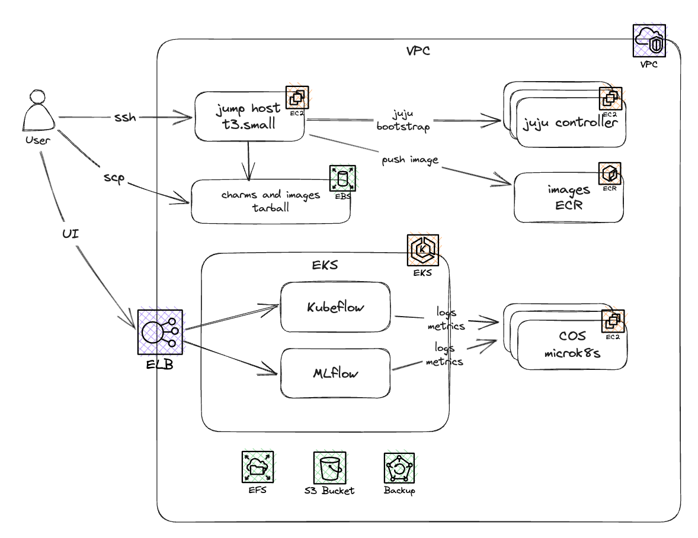

# Offline deployment guide
assumed architecture: 

## Prerequisites

### Setup private EKS cluster

### Setup container registry

### Upload images and charms

## Install juju

## Configure air-gapped juju

## Install Kubeflow

## Test Kubeflow